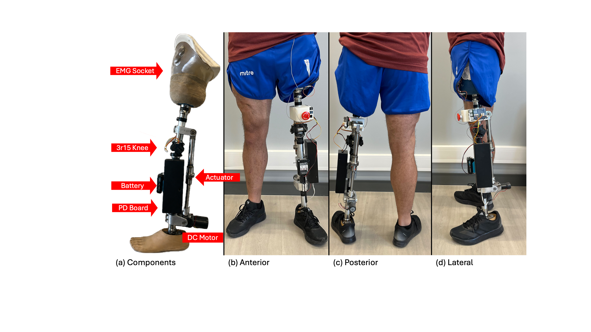
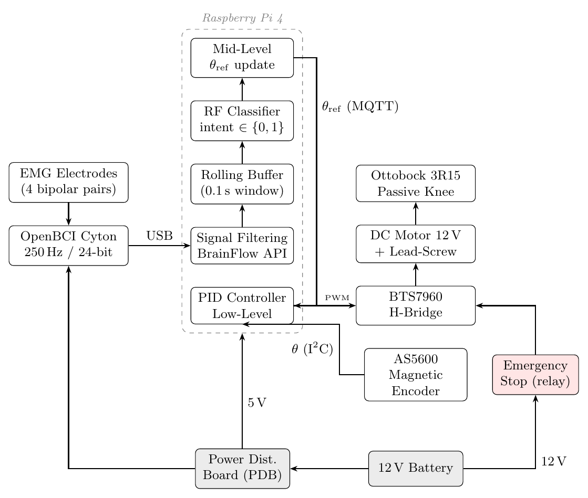

# Retrofit Leg Prosthesis: EMG-controlled active add-on for a passive transfemoral prosthesis

[](https://doi.org/10.5281/zenodo.22905783)

Open hardware and software for a **retrofit module that gives a passive prosthetic knee (Ottobock 3R15) active flexion and extension**, driven by surface EMG from the residual limb.

This repository accompanies the manuscript *"From Passive to Active: An EMG-Controlled Add-On Module for Transfemoral Prostheses"*. It contains everything needed to rebuild the prototype that raced at the **CYBATHLON 2024 Powered Leg Prosthesis Race**.



> [!WARNING]
> This is a **research prototype, not a medical device**. It was built and tested with a single user under supervision. It has no regulatory approval and must never be used without trained personnel, a reachable emergency stop and a clinician responsible for the socket fit. Read [docs/08_safety.md](docs/08_safety.md) before powering the motor.

## How it works

| Subsystem | Implementation |
|---|---|
| Host prosthesis | Ottobock 3R15 monocentric knee; the user's existing socket, pylons and foot are kept |
| Actuator | 12 V brushed DC worm-gear motor (5840-31ZY, 31:1) driving an SFU1610 ball screw (lead 10 mm) between thigh and shank attachment points. The worm gear is self-locking, so the knee holds its angle without power |
| Power | 12 V 1.5 Ah Li-ion pack (Makita 12 V max) → custom Power Distribution Board (LTC3780 12 V rail, LM2596 5 V rail, BTS7960 H-bridge, E-stop relay) |
| Sensing | 4-channel surface EMG (biceps femoris, rectus femoris, gluteus medius, adductor longus) with electrodes embedded in the socket, OpenBCI Cyton at 250 Hz; AS5600 magnetic encoder for the knee angle |
| Compute | One Raspberry Pi 4 runs everything: acquisition, filtering, Random-Forest intent classifier, knee-angle reference and the 100 Hz PID loop. The processes talk over a local MQTT broker (nanomq) |
| Control | Contraction → the knee reference flexes 5°; relaxation → it extends 5° (10 Hz, range 0–85°, 0 = extended). A predefined gait-pattern mode is also available |




## Repository layout

```
├── docs/                    Step-by-step build and operation guides (start here)
├── hardware/
│   ├── mechanical/          CAD (STEP / STL / Inventor), renders, motor-torque sizing
│   └── electronics/pdb/     Power Distribution Board: Gerbers, EasyEDA sources, BOM, schematic
├── software/                Python package `leg` that runs on the Raspberry Pi
│   ├── leg/io/stream.py             OpenBCI → filtered EMG → MQTT
│   ├── leg/models/train.py          Train the contract/relax Random Forest
│   ├── leg/models/realtime_inference.py   EMG-driven knee control
│   ├── leg/models/gait_csv_sender.py      Predefined gait-pattern control
│   ├── leg/models/motor_pid.py      AS5600 + BTS7960 PID position loop
│   ├── estimulos/test.py            Cue sequence for recording training data
│   └── test_code/                   Bench tests for motor, encoder and PID
└── analysis/                Metabolic-cost analysis notebook
```

## Build guide

1. [Bill of materials](docs/01_bill_of_materials.md)
2. [Mechanical build](docs/02_mechanical_build.md): mount the ball-screw actuator on the 3R15 knee
3. [Electronics](docs/03_electronics.md): fabricate and bring up the PDB, wire the Pi, motor, encoder and E-stop
4. [Raspberry Pi setup](docs/04_raspberry_pi_setup.md)
5. [EMG socket and acquisition](docs/05_emg_acquisition.md)
6. [Training the intent classifier](docs/06_training.md)
7. [Running the controller](docs/07_control.md)
8. [Safety checklist](docs/08_safety.md)
9. [Experimental protocol (metabolic evaluation)](docs/09_experimental_protocol.md)
10. [Known limitations and roadmap](docs/10_limitations_and_roadmap.md)

## Quick start (software only, no hardware)

```bash
cd software
python -m venv .venv && source .venv/bin/activate
pip install -r requirements.txt && pip install -e .
docker compose up -d                        # MQTT broker (nanomq) on localhost:1883
python -m leg.simulation.synthetic_stream   # BrainFlow synthetic board instead of the Cyton
python -m leg.models.realtime_inference --debug   # classifier only, no motor (needs a model.pkl)
```

## Citation

If you use this work, please cite the paper *"From Passive to Active: An EMG-Controlled Add-On Module for Transfemoral Prostheses"* (under review).

## Funding

Funded by ANID under grant CPS-RTC CIA250016.

## License

MIT: covers the software, hardware design files and documentation, provided "as is". See [LICENSE](LICENSE) and the medical [DISCLAIMER](DISCLAIMER.md).
