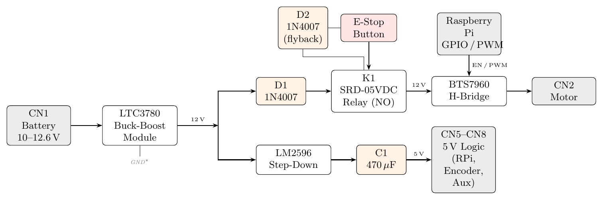
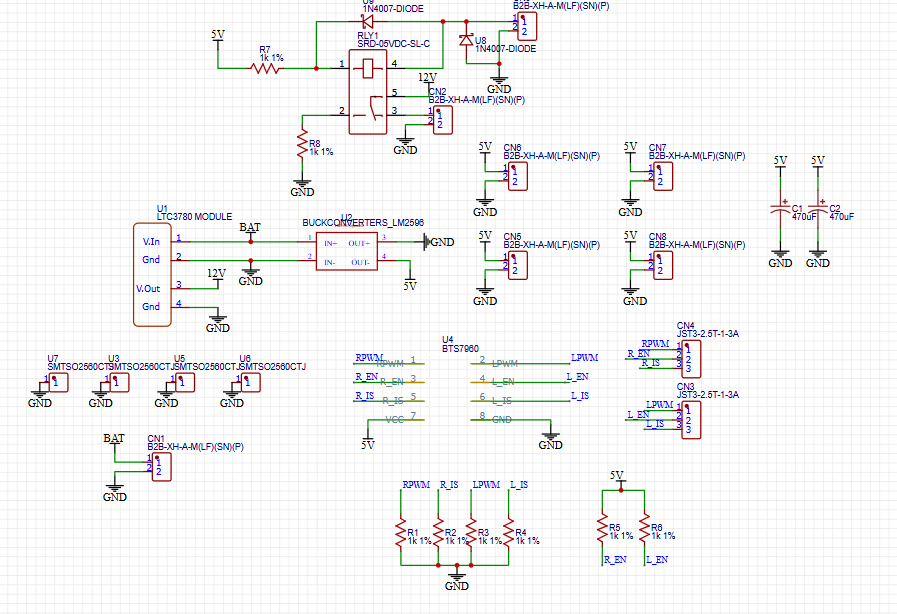

# 3. Electronics

## Power Distribution Board (PDB)

The PDB is a two-layer carrier board for off-the-shelf modules:

- **U1, LTC3780 buck-boost.** Turns the 10–12.6 V battery into a regulated **12 V** rail for the motor.
- **U2, LM2596 buck.** Steps the regulated 12 V down to the **5 V** logic rail (Raspberry Pi, encoder, BTS7960 logic).
- **U4, BTS7960 H-bridge.** Drives the motor (43 A peak; the board is operated at 5 A or less).
- **RLY1, SRD-05VDC relay.** Normally-open contact in the 12 V motor path. The E-stop button (CN9) opens it, which cuts motor power while the Pi stays on.
- **Protection.** 1N4007 flyback diode on the relay coil, a 1N4007 series diode on the 12 V motor line, 1 kΩ pull-downs on the PWM/IS lines (safe state at boot) and 1 kΩ pull-ups that keep R_EN/L_EN enabled.
- **Grounding.** Star ground: high-current motor returns and logic returns meet near the battery input.

Files in `hardware/electronics/pdb/`:

| File | Content |
|---|---|
| `gerber/PDB_gerber_2025-09-29.zip` | Fabrication files (upload as-is to JLCPCB or a similar service; 2 layers, 1.6 mm, default options) |
| `easyeda/PDB_schematic.json`, `easyeda/PDB_pcb.json` | Editable sources. In EasyEDA Std: *File → Open → EasyEDA…* and select the JSON |
| `PDB_BOM.csv` | Parts list |
| `PDB_schematic.png`, `PDB_layout_top.png`, `PDB_layout_bottom.png` | Quick-look images |

### Connectors

| Connector | Pins | Signal |
|---|---|---|
| CN1 | 1: +BAT, 2: GND | Battery input (10–12.6 V) |
| CN2 | 1: +12 V, 2: GND | Switched 12 V to the H-bridge / motor |
| CN3 | 1: LPWM, 2: L_EN, 3: L_IS | H-bridge control, left half |
| CN4 | 1: RPWM, 2: R_EN, 3: R_IS | H-bridge control, right half |
| CN5–CN8 | 1: +5 V, 2: GND | Logic outputs (Raspberry Pi, encoder, spare) |
| CN9 | 1: BTN IN, 2: BTN OUT | Emergency-stop button (drives the relay coil) |

### Bring-up (do this before connecting the Pi or the motor)

Use a bench supply set to 12 V with a 1 A current limit in place of the battery for steps 1–4.

1. Solder the modules and connectors. Before fitting the modules, check that there is no short between +BAT, +12 V, +5 V and GND.
2. Power CN1. Both module "on" LEDs should light. Adjust the **LTC3780** trimmer until its output reads **12.0 V**. If the output stays off, the undervoltage lock-out has tripped; adjust the trimmer closest to the battery input.
3. Adjust the **LM2596** to **5.0–5.1 V**. Check that the ripple is below 50 mVpp with C1/C2 fitted.
4. Press the E-stop and confirm there is **0 V on CN2**. Release it and confirm 12 V returns.
5. Connect the Raspberry Pi to a 5 V output and confirm it boots without brown-out (no lightning-bolt icon and no `Under-voltage detected` in `dmesg`).
6. Connect the H-bridge and the motor **with the actuator decoupled from the knee**, or with the knee held at mid-range. Run `software/test_code/motor_direction.py` and confirm both directions.
7. Load the motor at about 1 A and record the 12 V droop and module temperatures. Keep an eye on the BTS7960 heatsink.

## Wiring to the Raspberry Pi

| Signal | Pi pin (BCM) | Physical pin | Goes to |
|---|---|---|---|
| Motor PWM (20 kHz), **flexion** | GPIO 18 | 12 | H-bridge input that flexes the knee (RPWM or LPWM, whichever gives flexion on your build) |
| Motor PWM (20 kHz), **extension** | GPIO 13 | 33 | The other H-bridge input |
| I²C SDA | GPIO 2 | 3 | AS5600 SDA |
| I²C SCL | GPIO 3 | 5 | AS5600 SCL |
| 5 V in | — | 2 / 4 | PDB CN5 |
| GND | — | 6 | PDB CN5 GND (common with H-bridge GND) |
| USB | — | USB-A | OpenBCI RF dongle |

These pins are the ones in `software/leg/models/motor_pid.py` (`IN1 = 13`, `IN2 = 18`). A positive controller output (target angle above the measured angle, i.e. flex more) drives GPIO 18. If your knee moves the wrong way, swap the two PWM wires or the two motor leads. Do not swap the pins in software.

> [!CAUTION]
> The Pi's I²C lines are **3.3 V**. Many AS5600 breakouts have pull-up resistors to their own VCC. If you power the encoder from the 5 V rail, SDA and SCL will be pulled to 5 V. Either power the AS5600 from the Pi's **3.3 V** pin (physical pin 1) or remove the breakout's pull-ups.

## System wiring

- The OpenBCI Cyton sends its data to the Pi through its USB RF dongle. In the paper's build it is powered from the PDB 5 V rail. The CYBATHLON 2024 build used a separate 6 V battery pack instead, which keeps the EMG front-end isolated from the motor supply; consider it if you see motor noise in the EMG.
- Keep the EMG leads away from the motor cables and the BTS7960. Intermittent drop-outs of the EMG stream were the most common failure seen during testing; connectors, cable routing and shielding all matter.
