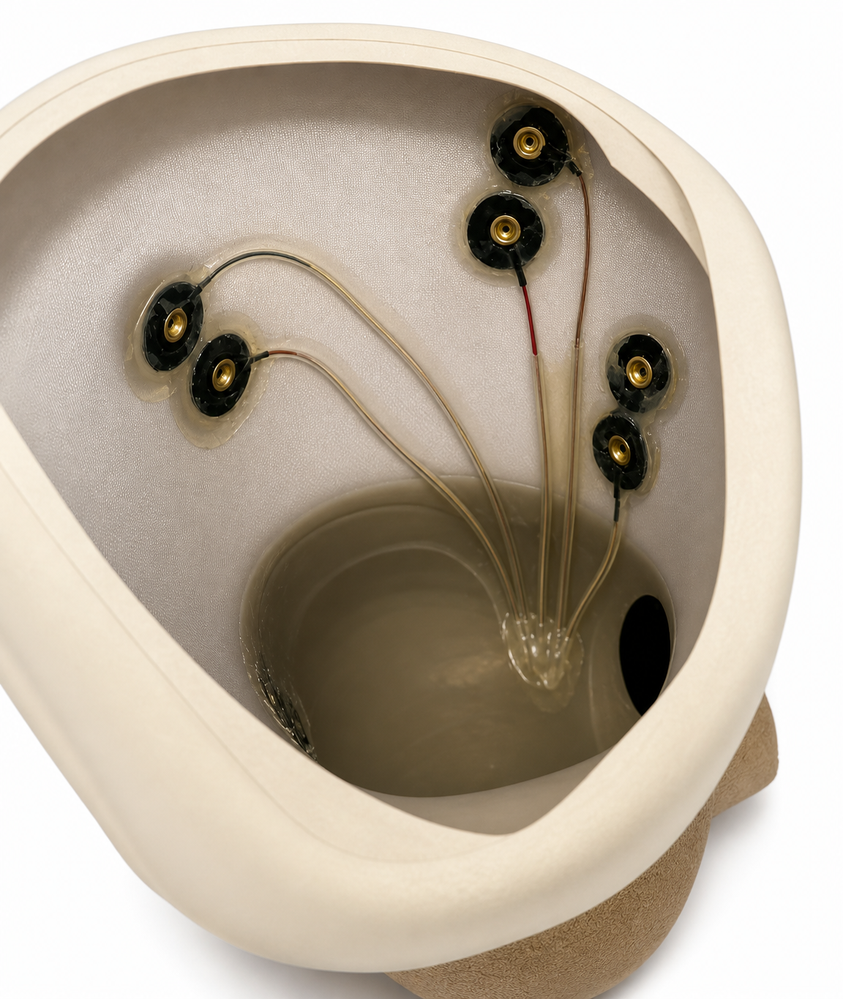

# 5. EMG socket and acquisition

## Muscles and channels

| Cyton channel | Muscle | Role |
|---|---|---|
| C1 | Biceps femoris (hamstrings) | Posterior thigh |
| C2 | Rectus femoris (quadriceps) | Anterior thigh |
| C3 | Gluteus medius | Hip abductor |
| C4 | Adductor longus | Hip adductor |

These are two agonist–antagonist pairs, one at the knee and one at the hip, that stay accessible after transfemoral amputation. In the paper's classifier, envelope features from **C3 (gluteus medius)** carried the most information.

## Electrode placement in the socket



1. The clinical team finds the muscle bellies on the residual limb **before the socket is fabricated**.
2. For each muscle, embed two **gold cup electrodes** in the inner wall of the socket, **20 mm apart and aligned with the muscle fibres**.
3. Put one common reference electrode over an electrically quiet area at the hip.
4. Route the leads inside the socket wall to one connector on the socket, then to the Cyton.
5. Before every session, clean the skin with alcohol and put conductive paste on each cup.

> The socket must be made by a certified prosthetist. Embedding electrodes changes the socket's inner surface, so check fit and comfort with the user before any powered trial.

## OpenBCI configuration

`leg/io/stream.py` configures the Cyton at start-up through BrainFlow:

- **Bipolar** montage: gain ×24 (`gain_set=6`), normal electrode input, bias on, SRB2 off, SRB1 off.
- The serial port is auto-detected (the only `usb` device). Override it with `--serial-port /dev/ttyUSB0`.

Wiring:

| Electrode | Cyton pin |
|---|---|
| Muscle *n* (n = 1–4), electrode pair | Channel *n* **N** (bottom) and **P** (top) pins |
| Common reference at the hip | **BIAS** pin |

See the [OpenBCI Cyton documentation](https://docs.openbci.com/Cyton/CytonLanding/) for the header layout.

## Real-time filtering and features

`leg/io/stream.py` reads the board every 32 ms, removes a constant 2250 offset, and filters each EMG channel with **stateful** SOS filters, so block boundaries leave no artefacts:

- 4th-order Butterworth band-pass, **20–120 Hz**
- IIR notch at **50 Hz**, Q = 30 (change `self.mains` to 60 in countries with 60 Hz mains)

The filtered block goes out on the MQTT topic `data`. Features are then computed per 0.1 s window by `leg/models/features.py` (see [06](06_training.md)). If the packet counter stops advancing for 20 consecutive reads, the stream releases and re-opens the BrainFlow session. This recovers from the intermittent dongle drop-outs seen in testing.


## Checking the signals

On a laptop on the same network:

```bash
export LEG_BROKER_HOST=retrofit-leg.local
python -m leg.plots.stream_plot
```

Ask the user to contract and relax. All four channels should show clear bursts. A flat or 50 Hz-dominated channel means poor contact; re-apply the paste or check the lead.
