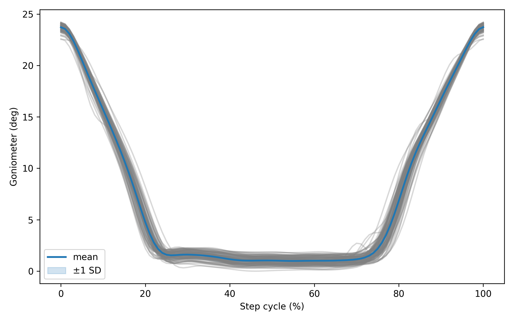

# 7. Running the controller

The control stack has three layers. Both operating modes share the same low-level loop.

```
High level  (10 Hz)   EMG window → features → Random Forest → intent ∈ {0, 1}
Mid level   (10 Hz)   intent → knee-angle reference θ_ref
Low level   (100 Hz)  PID → sign → BTS7960 at full duty (20 kHz PWM)
```

Knee angles run from **0° (fully extended) to 85° (flexed)**. See the encoder calibration in [04](04_raspberry_pi_setup.md).

## Mode A: EMG-driven intent control

```bash
docker compose up -d                        # broker, if not already running
python -m leg.io.stream                     # terminal 1
python -m leg.models.realtime_inference     # terminal 2 (model.pkl in the working directory)
```

To run the classifier without touching the motor (watch the reference on the `marker` topic), add `--debug`.

What `leg/models/realtime_inference.py` does:

- It keeps a rolling **0.1 s buffer** (25 samples) of C1–C4, fed by the `data` topic.
- Every **100 ms** it extracts the 36 features and passes them to the trained pipeline (normalisation → top-10 selection → Random Forest).
- **Contraction** raises the reference by **5°** (the knee flexes); **relaxation** lowers it by **5°** (the knee extends).
- Because the loop runs at 10 Hz, the reference slew rate is bounded at **50°/s** by construction, so abrupt setpoint changes cannot reach the low-level loop.
- The reference is clipped to **0–85°** and published on `marker` for logging.
- **Ctrl-C** sets the reference to 0° (fully extended) before exiting.

Piloting: the user learns to **contract to bend the knee and relax to straighten it**. Initiate motion *before* it is needed, since the actuator is slow. That anticipatory style worked for the Slopes and Wobbly Steps tasks at CYBATHLON.

## Mode B: predefined gait pattern

```bash
python -m leg.models.gait_csv_sender --speed 0.1 --n-samples 5 --log-csv run.csv
```

This mode plays back a knee-angle trajectory from `knee_angle_gait_short.csv` (default: 0° → 60° → 0°), resampled to `--n-samples` points. It advances one point every `1 / (10 × speed)` seconds and pauses 1.5 s between cycles. Every point is shifted by a hard-coded **−7°** (`angle -= 7`). Remove that line, or adjust the offset, for your build, because a negative target pushes the actuator against full extension. `--log-csv` saves target and measured angle over time. `knee_angle_gait.csv` holds a full normative gait-cycle profile (8–65°) that you can pass with `--csv`.



## Low-level loop: `leg/models/motor_pid.py`

- Reads the AS5600 over I²C at **100 Hz** (12-bit, 0.088° per count) and converts it to the knee angle using the calibration constants.
- Discrete PID using the measured sample interval, so scheduling jitter does not bias the I and D terms. The integral is clamped to ±100, and the derivative term is skipped on the first sample after a reset.
- Gains (tuned on the bench): **Kp = 10, Ki = 0.1, Kd = 0.15**. Change them with `MotorPIDController(kp=…, ki=…, kd=…)`.
- **Drive law:** the sign of the PID output selects the direction. A positive output drives GPIO 18 (flexion) and a negative output drives GPIO 13 (extension), at **100 % duty** with **20 kHz PWM**. The other input is held at 0. Because the screw is highly reduced and non-back-drivable, the switching does not reach the joint as abrupt motion. The cost is a small limit cycle around the reference.

## Monitoring

From a laptop: `LEG_BROKER_HOST=retrofit-leg.local python -m leg.plots.stream_plot` shows the EMG channels live, and the marker channel shows the knee reference. `python -m leg.io.store_stream` records everything to `.npy` for later analysis.

## Performance to expect

- Walking assistance works on a treadmill at about **1 km/h**; tracking degrades when the reference changes quickly.
- Stairs, obstacle clearance and high steps were **not** achievable with this actuator and binary control (see [10](10_limitations_and_roadmap.md)).
