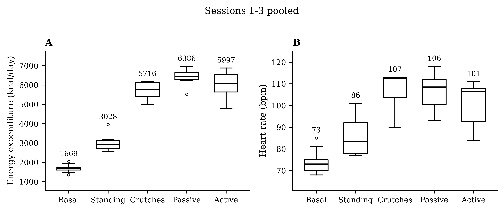
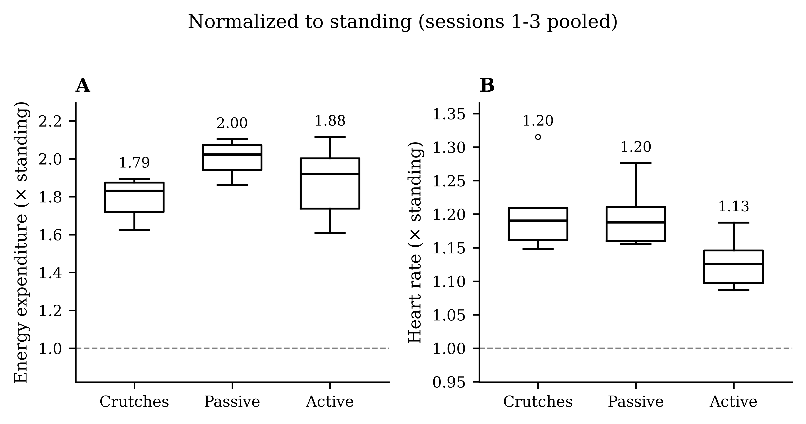

# 9. Experimental protocol (metabolic evaluation)

This is the protocol used in the paper to compare the energy cost of walking with **bilateral crutches**, the participant's **passive prosthesis** and the **active prosthesis**. It needs ethics-committee approval and informed consent.

## Equipment

- Indirect calorimetry: COSMED Q-NRG Max (breath-by-breath, exported as 30 s averages)
- Heart-rate chest strap synchronised with the metabolic monitor
- Motorised treadmill with lateral handrails (Lode Valiant Sport in the paper)

## Resting measurement (once, at the start of session 1)

- Overnight fast of at least 8 h; no caffeine from the previous evening.
- The participant removes the prosthesis and lies supine for **30 min** in a quiet, darkened room. Record gas exchange throughout.
- Use the window from 2 to 28 min as the resting metabolic rate.

## Each session (3 sessions)

1. **Standing baseline:** 10 min on the treadmill without the prosthesis, holding the handrails.
2. **Three walking conditions, 10 min each at 1 km/h**, with 3 min of seated rest between them (used to swap and check the prosthesis):
   - Crutches: no prosthesis, both crutches
   - Passive prosthesis (handrails allowed)
   - Active prosthesis in gait-pattern mode (handrails allowed)
3. Rotate the order across sessions to limit order effects:
   - Session 1: crutches → passive → active
   - Session 2: passive → active → crutches
   - Session 3: active → crutches → passive

## Analysis

`analysis/metabolic_analysis.ipynb` reads the COSMED exports and produces the figures below.

- Put `ses_1.xlsx`, `ses_2.xlsx`, `ses_3.xlsx` and `ree.xlsx` in `analysis/data/`.
- Each session file needs a `Fase` column labelling the phases: `parado` (standing), `bastones` (crutches), `pasiva`, `activa`.
- For each phase, the last minute (2 × 30 s rows) is taken as steady state.
- Energy expenditure (`EEkc`, kcal/day) and heart rate are reported pooled over the sessions, and also normalised to the **same session's** standing mean. Normalising removes the drift in baseline between sessions.

With a single participant, report results descriptively (mean ± SD) without inferential statistics.

## EMG training protocol

See [06](06_training.md). It ran before every control session.
